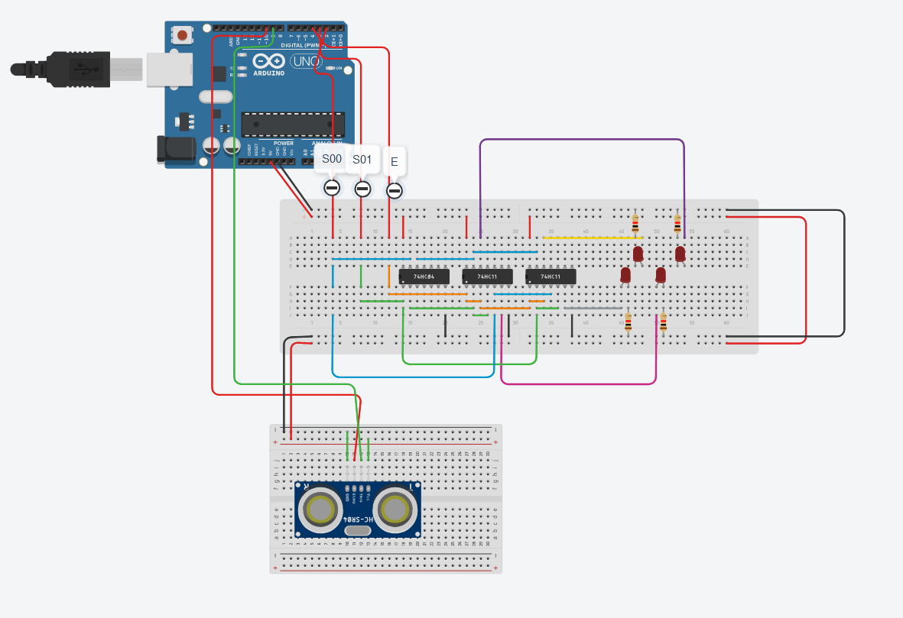

<h1>Sensor de distância</h1>

<a href = "https://www.tinkercad.com/things/2sxkdPWAgp6-demux?sharecode=ZxOLf8bxN2CzwLfVCAcd_46f3eWS7ewTjyQRGTM-RlY">TINKERCAD</a>

Projeto avaliativo criado para a matéria de Sistemas Digitais, onde minha equipe teve como objetivo a criação de um sistema que utilizasse um demultiplexador.

Consiste em um sensor de distância em que dependêndo da distância acente um LED em específico. Cada LED tem sua própria faixa de distância e quando o objeto está muito longe, todos os LEDs são apagados.

<h2>Contribuidores do Projeto:</h2>

César Gabriel Meirelles (https://github.com/cesargabrielM)

Alexandre Choratto(https://github.com/AlexandreChoratto)

Lucas Lima()

João Lessa(https://github.com/jowne)

<h1>Como foi construído?</h1>
<h3>Peças utilizadas:</h3>

1x Sensor de distância (HC - SR04);

1x Inversos Hexadecimal (ci 7404);

2x Portas AND (ci 7411);

1x Arduino;

4x LEDS;

4x resistores.

<h3>TINKERCAD x Projeto Real</h3>

No projeto real, foi uma versão simplificada do tinkercad, pois foi possível a utilização de um circuito integrado Decodificador (ci 4051).

